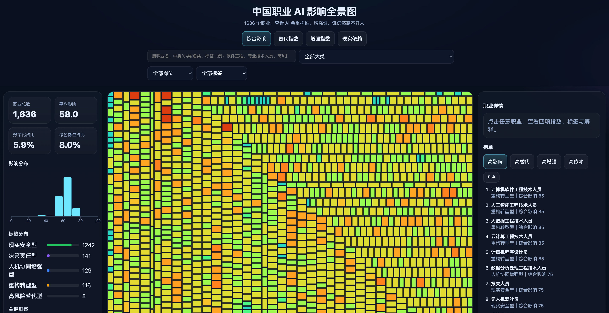
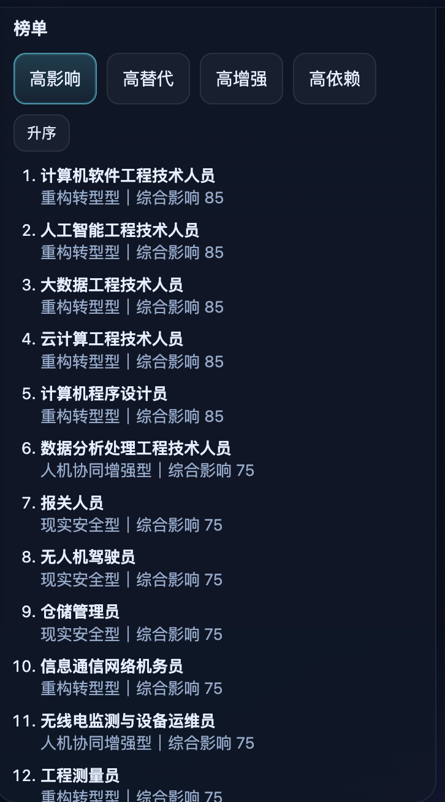
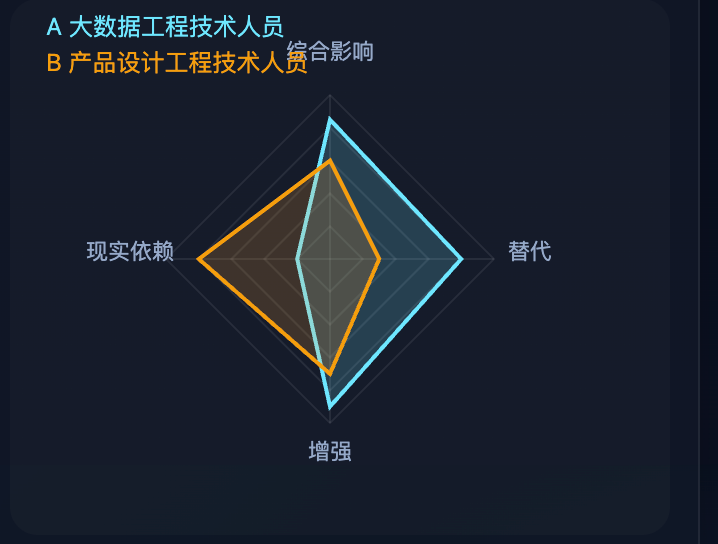

# 中国职业 AI 影响全景图

&#x20;  &#x20;

**面向中国职业体系的 AI 影响可视化分析平台**\
**China AI Job Map: An Interactive Visualization of AI Impact on Occupations in China**

[在线演示](https://dingtiansong.github.io/china-ai-job-map/) · [源码仓库](https://github.com/dingtiansong/china-ai-job-map)

---

## 目录

- [项目简介](#项目简介)
- [在线访问](#在线访问)
- [项目预览](#项目预览)
- [核心能力](#核心能力)
- [方法框架](#方法框架)
- [原始数据来源](#原始数据来源)
- [数据结构说明](#数据结构说明)
- [数据版本说明](#数据版本说明)
- [技术栈](#技术栈)
- [项目结构](#项目结构)
- [本地运行](#本地运行)
- [部署方式](#部署方式)
- [适用场景](#适用场景)
- [免责声明](#免责声明)
- [参考与致谢](#参考与致谢)
- [项目定位](#项目定位)
- [后续规划](#后续规划)
- [License](#license)

---

## 项目简介

中国职业 AI 影响全景图（China AI Job Map）是一个面向中国职业体系的交互式可视化分析项目，聚焦人工智能对职业结构、任务形态与岗位能力要求的影响。

项目基于中国职业分类细类数据，从 **AI 替代、AI 增强、现实依赖、综合影响** 四个维度，对职业进行结构化表达，并通过可视化方式帮助用户理解：

- 哪些职业更容易被 AI 自动化重构
- 哪些职业更适合通过 AI 获得显著增强
- 哪些职业对现实场景、现场执行和责任承担依赖更高
- AI 将如何改变职业的工作方式、任务结构与能力要求

本项目适用于职业研究、行业洞察、教育咨询、职业规划、产品展示与公众传播等场景。

---

## 在线访问

- **在线演示**：[https://dingtiansong.github.io/china-ai-job-map/](https://dingtiansong.github.io/china-ai-job-map/)
- **源码仓库**：[https://github.com/dingtiansong/china-ai-job-map](https://github.com/dingtiansong/china-ai-job-map)

---

## 项目预览

> 你可以在这里放仓库截图，增强 GitHub 首页展示效果。

### 首页 / 职业影响地图

```

如果你已经准备好截图，可以替换为：

```md



```

---

## 核心能力

### 1. 职业影响矩形树图（Treemap）

以职业为最小分析单元，通过矩形树图直观展示职业分布与 AI 影响程度：

- 图块大小反映任务量或综合规模估算
- 图块颜色支持按不同指标切换
- 可从整体视角观察职业结构与影响差异

### 2. 多维指标切换

支持以下核心指标的切换与展示：

- 综合影响指数（AI Impact Index）
- 替代指数（AI Replaceability Index）
- 增强指数（AI Augmentation Index）
- 现实依赖指数（Real-World Dependency Index）

### 3. 条件筛选与职业搜索

支持在当前数据视图中进行筛选与定位：

- 按职业大类筛选
- 按数字化岗位 / 非数字化岗位筛选
- 按标签分类筛选
- 通过搜索框快速定位职业并在图中高亮

### 4. 左侧统计与分布分析面板

提供与当前视图关联的辅助分析能力：

- 汇总统计
- 指数分布直方图
- 标签分布
- 简要洞察摘要

### 5. 职业详情查看

支持查看单个职业的详细信息，包括：

- 四项核心指数
- 职业标签
- 职业描述
- 主要工作任务
- 各指标解释文案

### 6. 榜单视图

支持按当前指标对职业进行排序，便于形成结构化观察与传播内容：

- 支持升序 / 降序切换
- 可用于生成高风险职业、增强型职业、安全型职业等榜单

### 7. 职业对比

支持两个职业之间的指标对比：

- 基于雷达图展示四项核心指标差异
- 支持通过图中选择或快捷方式设定对比对象

### 8. 分享能力

支持将当前职业生成分享卡片并导出为 PNG，用于报告截图、社交传播或内容分发。

---

## 方法框架

本项目采用“3+1”职业影响分析框架：

### 三个基础维度

- **AI 替代指数**：衡量核心任务被 AI 直接自动化完成的可能性
- **AI 增强指数**：衡量 AI 对职业效率、质量与产出的提升空间
- **现实依赖指数**：衡量职业对现场环境、面对面互动、责任承担与情境判断的依赖程度

### 一个综合维度

- **综合影响指数**：综合反映 AI 对职业工作方式、任务结构和能力要求的重构程度

该框架强调：

- 不以职业名称主观判断
- 不简单将“高影响”理解为“会消失”
- 更关注职业任务的重构与人机协同关系

---

## 原始数据来源

### 1. 中国职业分类底座

本项目的职业分类框架来源于 **《中华人民共和国职业分类大典（2022年版）》**。该大典构成中国职业体系的官方分类基础，包含职业大类、中类、小类及更细粒度职业分类，可作为本项目职业对象组织与映射的底层骨架。

项目中使用的职业分类字段（如大类 / 中类 / 小类 / 细类）均基于这一体系进行组织。

### 2. 项目数据文件

项目运行时的核心数据文件为：

```text
data/jobs.json
```

该文件为职业对象数组，通常包含以下类型字段：

| 类别        | 字段示例                                                                              |
| --------- | --------------------------------------------------------------------------------- |
| 标识与分类     | `record_id`、`big_category`、`middle_category`、`small_category`、`detail_category`   |
| 展示名称      | `occupation_name`                                                                 |
| 描述与任务     | `detail_description`、`detail_tasks`                                               |
| 指数（0–100） | `ai_impact_index`、`ai_replace_index`、`ai_augment_index`、`real_world_index`        |
| 标签        | `label`                                                                           |
| 岗位属性      | `is_digital`、`is_green`                                                           |
| 指标说明      | `replace_rationale`、`augment_rationale`、`real_world_rationale`、`impact_rationale` |

> 具体字段以仓库内 `data/jobs.json` 为准。

### 3. 指数数据说明

本项目中的 AI 相关指数并非来自国家统计部门的官方现成发布结果，而是基于职业描述、任务结构、自动化判断逻辑与项目侧的评分方法构建而成，用于职业影响分析和可视化表达。

因此，项目中的指数应理解为 **研究型、分析型指标**，而非官方行政统计口径。

---

## 数据结构说明

项目推荐的数据对象结构示例：

```json
{
  "record_id": "1-01-00-01",
  "big_category": "党的机关、国家机关、群众团体和社会组织、企事业单位负责人",
  "middle_category": "中国共产党机关和基层组织负责人",
  "small_category": "中国共产党机关和基层组织负责人",
  "detail_category": "中国共产党机关负责人",
  "occupation_name": "中国共产党机关负责人",
  "detail_description": "在中国共产党中央和地方各级机关及其工作机构中，担任领导职务的人员。",
  "detail_tasks": "负责机关重要事务决策、管理与统筹协调。",
  "ai_impact_index": 33,
  "ai_replace_index": 25,
  "ai_augment_index": 12,
  "real_world_index": 45,
  "label": "重构转型型",
  "is_digital": false,
  "is_green": false,
  "replace_rationale": "部分信息处理和文稿事务可被AI辅助或替代。",
  "augment_rationale": "AI可用于政策梳理、材料生成与决策支持。",
  "real_world_rationale": "该岗位仍需强组织协调与现实责任承担。",
  "impact_rationale": "整体将受到流程重构影响，但不会被简单替代。"
}
```

---

## 数据版本说明

建议为项目数据持续维护版本记录，例如：

- **v1.0**：完成职业分类底座整理
- **v1.1**：补充四项核心指数
- **v1.2**：增加标签与各维度解释文案
- **v1.3**：增加职业对比、榜单与分享卡片支持
- **v1.4**：优化筛选、统计与可视化交互

你可以在后续迭代中，根据数据质量、评分策略、字段扩展情况持续更新这一部分。

---

## 技术栈

本项目采用轻量前端架构，便于部署、维护与扩展：

- **页面结构**：HTML5
- **样式系统**：CSS3
- **交互逻辑**：原生 JavaScript
- **数据可视化**：D3.js v7（CDN 引入）

---

## 项目结构

```text
china-ai-job-map
├── index.html
├── compare.html
├── ranking.html
├── methodology.html
├── css/
│   └── style.css
├── js/
│   ├── app.js
│   ├── treemap.js
│   ├── ranking.js
│   ├── compare.js
│   ├── search.js
│   └── share.js
├── data/
│   └── jobs.json
├── assets/
└── .nojekyll
```

实际目录结构可根据你当前仓库版本进行调整。

---

## 本地运行

由于项目依赖浏览器加载本地 JSON 数据，建议通过本地静态服务器运行，而不是直接双击 HTML 文件。

### 方式一：Python

```bash
python -m http.server 8000
```

### 方式二：Node.js

```bash
npx serve .
```

启动后访问：

```text
http://localhost:8000
```

---

## 部署方式

项目可直接部署到任意静态站点托管平台，例如：

- GitHub Pages
- Vercel
- Cloudflare Pages
- 阿里云 OSS 静态网站托管
- 腾讯云 COS 静态站点托管

当前仓库已支持 GitHub Pages 访问。

---

## 适用场景

本项目可用于：

- 中国职业 AI 影响研究
- 行业洞察与趋势解读
- 教育与职业规划咨询
- 数据新闻与内容传播
- AI 产品展示与交互可视化
- 政策与产业分析辅助

---

## 免责声明

本项目旨在提供一个面向中国职业体系的 AI 影响可视化研究工具，用于辅助理解职业结构变化、任务重构趋势与人机协同关系。

需要特别说明的是：

1. **本项目不是官方职业统计发布平台**
   项目中的 AI 指数、标签和解释文案不代表任何官方机构、监管部门或用人单位的正式结论。

2. **本项目不是严肃的经济预测或就业结论发布**
   它不直接预测失业率、岗位消失率或具体就业规模变化，也不构成求职、裁员、投资、政策制定等场景下的唯一依据。

3. **“高影响”不等于“职业消失”**
   高影响可能意味着自动化、增强、流程重构、岗位升级或能力迁移，而不必然意味着职业被完全替代。

4. **指数结果具有方法依赖性与版本依赖性**
   不同评分规则、任务拆分方式、模型能力边界和数据版本，可能导致结果变化。随着 AI 技术演进，部分职业的分值也应被持续更新。

如果你希望将本项目结果用于研究、报告、媒体传播或教学，请结合具体场景、样本边界与版本说明进行解释。

---

## 参考与致谢

本项目在可视化表达方式上，参考了 Andrej Karpathy 的 `karpathy/jobs` 项目。该项目被作者定义为一个用于可视化探索职业与 AI 关系的研究型工具，而非正式报告、论文或严肃经济出版物。

中国职业 AI 影响全景图在整体思路上借鉴了其“职业结构 + 指标映射 + 交互探索”的表达方式，但在以下方面进行了中国化扩展：

- 使用中国职业分类体系作为职业底座
- 以细类职业为核心分析对象
- 引入替代、增强、现实依赖、综合影响四维框架
- 增加标签、职业对比、分享卡片等产品化能力

参考项目：

- **Karpathy Jobs**：[https://github.com/karpathy/jobs](https://github.com/karpathy/jobs)
- **Online Demo**：[https://karpathy.ai/jobs/](https://karpathy.ai/jobs/)

---

## 项目定位

这不是一个单纯的“职业风险排行工具”，而是一个面向中国职业体系的 AI 职业影响分析平台。

它试图回答的不是“哪个职业会消失”，而是：

> 在 AI 时代，中国职业将如何被重构。

---

## 后续规划

后续将重点扩展以下方向：

- 更精细的职业评分与校准机制
- 行业专题页与城市专题页
- 更完整的职业对比分析
- 更丰富的分享与传播组件
- 更清晰的方法说明与数据版本管理
- 更强的 SEO 与职业详情页结构化展示

---

